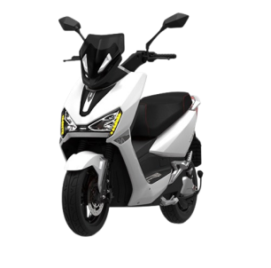
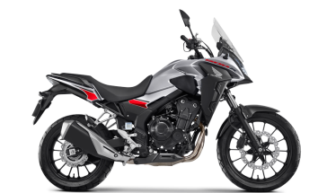

# Site-ByeCar
------------------------- HTML -----------------------------------------

O HTML foi divido em duas partes: 'header' e 'main'

No 'header' foram posicionados a Logo DNC e o nome da marca de aluguel de motos conforme segue: 

    <header>
        
        
    </header>

Já a sessão 'main' foi subdividida em duas divs conforme explicado abaixo:

Na primeira foi inserido todo o bloco a esquerda do site:

        

            <h2>Ter <strong>uma moto</strong> por asinatura nunca foi tão fácil</h2>
            
        

  
  
  E na segunda foi inserido todo o bloco a direita do site:

        

            

                <h2>Conheça nossas <spam><strong>motos</strong></spam>!</h2>   
            

            

               <button onclick="goBack()">
                
               </button> 
            <ul class="carousel-container">
                <li id="moto">
                    <h1 class="biggerLetter"><strong>Scooter Elétrica Voltz EV1</strong></h1>
                    
                    <h2 class="mediumLetter">A partir de</h2>
                    
R$619,90

                    <h3 class="smallLetter">Plano de 30 meses</h3>
                </li>
                <li id="moto">
                    <h1 biggerLetter><strong>Scooter Elétrica Voltz EV1</strong> </h1>
                    
                    <h2 class="mediumLetter">A partir de</h2>
                    
R$619,90

                    <h3 class="smallLetter">Plano de 30 meses</h3>
                </li>
            </ul>
            <button onclick="goNext()">
                
            </button>
            

            

                <button onclick="showCard()">Saiba Mais</button>   
            
    
        

  
  
  ------------------------- JavaScript -----------------------------------------
  1)Por meio da função showCard() é possível mostar mais informaçõe sobre a moto selecionada após clicar no botão "Saiba Mais" 
  function showCard(){
        if (carouselItens[index].style.visibility = "visible"){   //se o card resumo da moto estiver visível...//
        MoreInformation[index].style.display = "block";           //...mostre o card com detalhes sobre a moto//
        }
  }
  

  
  2) Por meio da função closeWindow() é possível fechar o card com informações detalhadas sobre a moto após clicar no 'X' 
  function closeWindow(index){
    MoreInformation[index].style.display="none";
  }
  
  3)Por meio da função AutomaticCarousel() é possível passar automaticamente de um card resumo para outro. OBS: Nessa versão só foi possível automatizar o carrosel num sentido, sendo assim, ainda é necessário avaliar o que pode ser feito para que  carrosel funcione nos dois sentidos.
  
  function AutomaticCarousel(){
    if(index < carouselItens.length - 1){
        index++
        carouselItens[index].scrollIntoView({ behavior: "smooth" })
    }if (index = carouselItens.length -1){
        index = 0
        carouselItens[index].scrollIntoView({ behavior: "smooth" })
    }
   }
   
   4) A função goNext() comanda seta da direita na qual o usuário pode controlar o carrosel 
   
   function goNext(){
    if(index === (carouselItens.length) - 1){
        index = 0
    }else{
        index++
    }
    carouselItens[index].scrollIntoView({behavior:"smooth"});
    }
    

      
    5) A função goBack() comanda seta da esquerda na qual o usuário pode controlar o carrosel 
    
    function goBack(){
    if(index === 0){
        index = carouselItens.length - 1
    }else{
        index--
    }
    carouselItens[index].scrollIntoView({behavior:"smooth"});
    }
     
  
  
